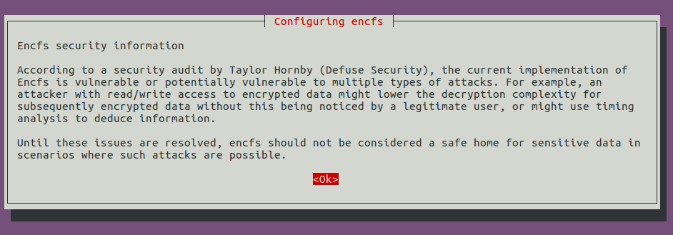
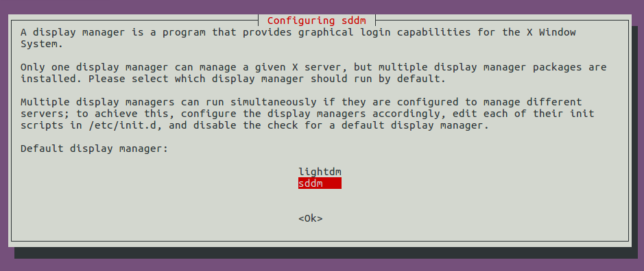
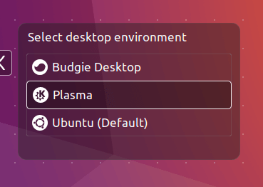

---
title: "Ubuntu Settings"
author: [Ruohong Jiao]
date: "2020-04-03"
keywords: [Initialize]
titlepage: true
titlepage-rule-color: "360049"
...
# Establish a Ubuntu 18.04 Server

## Ubuntu Server

[**ubuntu server 18.04 distro**](https://ubuntu.com/download/server)

## Change Sources

/etc/apt

``` cpp
sudo cp ./sources.list ./sources.list.backup
```

/etc/apt/sources.list

``` cpp
# tsinghua
deb https://mirrors.tuna.tsinghua.edu.cn/ubuntu/ bionic main restricted universe multiverse
deb https://mirrors.tuna.tsinghua.edu.cn/ubuntu/ bionic-updates main restricted universe multiverse
deb https://mirrors.tuna.tsinghua.edu.cn/ubuntu/ bionic-backports main restricted universe multiverse
deb https://mirrors.tuna.tsinghua.edu.cn/ubuntu/ bionic-security main restricted universe multiverse

# ustc
deb https://mirrors.ustc.edu.cn/ubuntu/ bionic main restricted universe multiverse
deb https://mirrors.ustc.edu.cn/ubuntu/ bionic-updates main restricted universe multiverse
deb https://mirrors.ustc.edu.cn/ubuntu/ bionic-backports main restricted universe multiverse
deb https://mirrors.ustc.edu.cn/ubuntu/ bionic-security main restricted universe multiverse
```

update

``` cpp
sudo apt-get update
sudo apt-get upgrade
```

## Make Usr Dirs

~/

``` cpp
mkdir usrname
```

~/usrname

``` cpp
mkdir Apps
mkdir Documents
mkdir Downloads
mkdir Workplaces
```

## Install Necessary pkgs

``` cpp
sudo apt-get install git tmux openssh-server mosh python-dev python3-dev libncurses5-dev python-pip python3-pip build-essential cmake perl-tk wget zip unzip python-m2crypto libsodium23 tsocks
```

## Download Installer

- [**Oracle JDK 8**](https://www.oracle.com/java/technologies/javase-jdk8-downloads.html)  
- [**TexLive 2019**](http://tug.org/texlive/acquire-netinstall.html)  
- [**Anaconda mirror from tsinghua**](https://mirrors.tuna.tsinghua.edu.cn/)
- [**Vim**](https://www.vim.org/)

    ~/usrname/Downloads

    ``` cpp
    git clone https://github.com/vim/vim.git
    ```

- [**Shadowsocksr**](https://github.com/shadowsocksrr/shadowsocksr) 

    [**doc**](https://arcdetri.github.io/shadowsocksr-ssr-on-ubuntu.html)

    ~/usrname/Apps

    ``` cpp
    curl https://github.com/shadowsocksrr/shadowsocksr/archive/3.2.2.zip
    ```

## Config Proxies

- git proxy

    ``` cpp
    git config --global user.name "me"
    ```

    ~/.gitconfig

    ``` cpp
    [user]
        name = usr
        email = usr@xxx.com
    [push]
        default = simple
    [http]
        proxy = socks5://127.0.0.1:1080
    [https]
        proxy = socks5://127.0.0.1:1080
    ```

- curl proxy
  
  [**reference**](https://gist.github.com/yougg/5d2b3353fc5e197a0917aae0b3287d64)

  ~/.bashrc and ~/.zshrc in future

  ``` cpp
  # set http socks proxy (local DNS)
  export http_proxy=socks5://127.0.0.1:1080
  # set https socks proxy (local DNS)
  export https_proxy=socks5://127.0.0.1:1080
  ```

  update

  ``` cpp
  source ~/.bashrc
  ```

- proxy software (ssr)

    ~/usrname/Apps/shadowsocksr

    ``` cpp
    bash initcfg.sh
    ```

    ~/usrname/Apps/shadowsocksr/user-config.json

    ``` cpp
    {
        "server": "remote.server",
        "server_ipv6": "::",
        "server_port": remote.server.port,
        "local_address": "127.0.0.1",
        "local_port": 1080,

        "password": "m",
        "method": "aes-128-ctr",
        "protocol": "auth_chain_a",
        "protocol_param": "",
        "obfs": "tls1.2_ticket_auth",
        "obfs_param": "",
        "speed_limit_per_con": 0,
        "speed_limit_per_user": 0,

        "additional_ports" : {}, // only works under multi-user mode
        "additional_ports_only" : false, // only works under multi-user mode
        "timeout": 120,
        "udp_timeout": 60,
        "dns_ipv6": false,
        "connect_verbose_info": 0,
        "redirect": "",
        "fast_open": false
    }
    ```

    ~/usrname/Apps/shadowsocksr/shadowsocks

    ``` cpp
    sudo python ./local.py -d start
    ```

## Install pkgs

- Open JDK 8, Open JDK 11 and Oraclo JDK 8

    ``` cpp
    sudo apt-get install openjdk-8-jdk openjdk-11-jdk
    ```

    ~/usrname/Downloads

    ``` cpp
    sudo tar xvf jdk-8u241-linux-x64.tar.gz --directory /usr/lib/jvm/
    ```

  - Set Oraclo JDK PATH

    ~/.bashrc and ~/.zshrc in future

    ``` cpp
    # Oracle Java JDK
    export JAVA_HOME=/usr/lib/jvm/jdk1.8.0_241
    export JRE_HOME=${JAVA_HOME}/jre
    export CLASSPATH=.:${JAVA_HOME}/lib:${JRE_HOME}/lib
    export PATH=${JAVA_HOME}/bin:$PATH
    ```

    update

    ``` cpp
    source ~/.bashrc
    ```

  - Set alias for Javas and Sys Pythons
    - Java
      - jdk1.8.0_241

        ``` cpp
        sudo update-alternatives --install /usr/bin/java java /usr/lib/jvm/jdk1.8.0_241/bin/java 1200
        sudo update-alternatives --install /usr/bin/javac javac /usr/lib/jvm/jdk1.8.0_241/bin/javac 1200
        sudo update-alternatives --install /usr/bin/javadoc javadoc /usr/lib/jvm/jdk1.8.0_241/bin/javadoc 1200
        sudo update-alternatives --install /usr/bin/javap javap /usr/lib/jvm/jdk1.8.0_241/bin/javap 1200
        sudo update-alternatives --install /usr/bin/javah javah /usr/lib/jvm/jdk1.8.0_241/bin/javah 1200
        sudo update-alternatives --install /usr/bin/javafxpackager javafxpackager /usr/lib/jvm/jdk1.8.0_241/bin/javafxpackager 1200
        sudo update-alternatives --install /usr/bin/javapackager javapackager /usr/lib/jvm/jdk1.8.0_241/bin/javapackager 1200
        sudo update-alternatives --install /usr/bin/javaws javaws /usr/lib/jvm/jdk1.8.0_241/bin/javaws 1200
        sudo update-alternatives --install /usr/bin/java-rmi.cgi java-rmi.cgi /usr/lib/jvm/jdk1.8.0_241/bin/java-rmi.cgi 1200
        ```

      - java-11-openjdk-amd64

        ``` cpp
        sudo update-alternatives --install /usr/bin/java java /usr/lib/jvm/java-11-openjdk-amd64/bin/java 1111
        sudo update-alternatives --install /usr/bin/javac javac /usr/lib/jvm/java-11-openjdk-amd64/bin/javac 1111
        sudo update-alternatives --install /usr/bin/javadoc javadoc /usr/lib/jvm/java-11-openjdk-amd64/bin/javadoc 1111
        sudo update-alternatives --install /usr/bin/javap javap /usr/lib/jvm/java-11-openjdk-amd64/bin/javap 1111
        ```

      - java-8-openjdk-amd64

        ``` cpp
        sudo update-alternatives --install /usr/bin/java java /usr/lib/jvm/java-8-openjdk-amd64/bin/java 1081
        sudo update-alternatives --install /usr/bin/javac javac /usr/lib/jvm/java-8-openjdk-amd64/bin/javac 1081
        sudo update-alternatives --install /usr/bin/javadoc javadoc /usr/lib/jvm/java-8-openjdk-amd64/bin/javadoc 1081
        sudo update-alternatives --install /usr/bin/javap javap /usr/lib/jvm/java-8-openjdk-amd64/bin/javap 1081
        sudo update-alternatives --install /usr/bin/javah javah /usr/lib/jvm/java-8-openjdk-amd64/bin/javah 1081
        sudo update-alternatives --install /usr/bin/java-rmi.cgi java-rmi.cgi /usr/lib/jvm/java-8-openjdk-amd64/bin/java-rmi.cgi 1081
        ```

    - Sys Python and Python3

        ``` cpp
        sudo update-alternatives --install /usr/bin/python python /usr/bin/python2.7 10
        sudo update-alternatives --install /usr/bin/python python /usr/bin/python3.6 40
        sudo update-alternatives --install /usr/bin/python3 python3 /usr/bin/python3.6 40
        ```

- Texlive 2019

    remove old Texlive 2019

    ``` cpp
    rm -rf /usr/local/texlive/2019
    rm -rf ~/.texlive2019
    ```

    ~/usrname/Downloads

    ``` cpp
    tar xvf install-tl-unx.tar.gz
    ```

    ~/usrname/Downloads/install-tl-unx

    ``` cpp
    sudo perl install-tl

    [... messages omitted ...]

    Enter command: i

    [... when done, see below for post-install ...]
    ```

    ~/.bashrc , ~/.profile and ~/.zshrc in future

    ``` cpp
    # Texlive 2019
    export MANPATH=${MANPATH}:/usr/local/texlive/2019/texmf-dist/doc/man
    export INFOPATH=${INFOPATH}:/usr/local/texlive/2019/texmf-dist/doc/info
    export PATH=${PATH}:/usr/local/texlive/2019/bin/x86_64-linux
    ```

    update

    ``` cpp
    source ~/.bashrc
    source ~/.profile
    # source ~/.zshrc
    ```

    add Tex Fonts to Sys

    ``` cpp
    sudo cp /usr/local/texlive/2019/texmf-var/fonts/conf/texlive-fontconfig.conf /etc/fonts/conf.d/09-texlive.conf

    sudo fc-cache -fsv
    ```

    [**Tsinghua CTAN source**](https://mirrors4.tuna.tsinghua.edu.cn/help/CTAN/)

    ``` cpp
    tlmgr option repository https://mirrors.tuna.tsinghua.edu.cn/CTAN/systems/texlive/tlnet
    ```

- Pandoc

    ``` cpp
    sudo apt-get install pandoc
    ```

- Vim 8+

    ~/usrname/Downloads/vim/src

    ``` cpp
    make distclean

    ./configure \
    --with-features=huge \
    --enable-largefile \
    --enable-rubyinterp \
    --enable-pythoninterp \
    --enable-python3interp \
    --enable-luainterp \
    --enable-perlinterp \
    --enable-multibyte \
    --enable-cscope \
    --enable-terminal \
    --enable-fail-if-missing \
    --with-python-config-dir=/usr/lib/python2.7/config-x86_64-linux-gnu/ \
    --with-python-config-dir=/usr/lib/python3.8/config-3.8-x86_64-linux-gnu/ \
    --with-python3-command=python3

    sudo make

    sudo make install
    ```

  - Install Vundle, etc.

    [**Vundle**](https://github.com/VundleVim/Vundle.vim.git)

    make dirs

    ``` cpp
    mkdir ~/.vim
    mkdir ~/.vim/bundle
    ```

    clone Vundle

    ``` cpp
    git clone https://github.com/VundleVim/Vundle.vim.git ~/.vim/bundle/Vundle.vim
    ```

    make ~/.vimrc file

    ``` cpp
    vim ~/.vimrc
    ```

    after editing config file(~/.vimrc), install vim plugins in vim

    ``` cpp
    :PluginInstall
    ```

  - Build YouCompleteMe

    [**YouCompleteMe**](https://github.com/ycm-core/YouCompleteMe)

    ~/.vim/bundle/YouCompleteMe

    ``` cpp
    sudo python install.py --clangd-completer --java-completer

    # or we use proxy
    # sudo tsocks python install.py --clangd-completer --java-completer
    ```

    > **Attention**:  
    > python version is python 3.6

  - Vim Config file

    ~/.vimrc

    ``` cpp
    " ~/.vimrc
    " author: Ruohong Jiao
    " github: github.jiaoruohong

    " Vundle Settings
    " ----------------------------------------
    " Brief help
    " :PluginList       - lists configured plugins
    " :PluginInstall    - installs plugins; append `!` to update or just :PluginUpdate
    " :PluginSearch foo - searches for foo; append `!` to refresh local cache
    " :PluginClean      - confirms removal of unused plugins; append `!` to auto-approve removal
    "
    " see :h vundle for more details or wiki for FAQ

    set nocompatible
    filetype off

    set rtp+=~/.vim/bundle/Vundle.vim
    let vpath='~/.vim/bundle'

    call vundle#begin(vpath)
    Plugin 'VundleVim/Vundle.vim'

    " Files management
    " ----------------------------------------
    Plugin 'scrooloose/nerdtree'
    Plugin 'jistr/vim-nerdtree-tabs'

    " Appearance
    " ----------------------------------------
    Plugin 'vim-airline/vim-airline'

    " Coding
    " ----------------------------------------
    Plugin 'tmhedberg/SimpylFold'
    Plugin 'vim-scripts/indentpython.vim'
    Plugin 'Valloric/YouCompleteMe'
    Plugin 'ctrlpvim/ctrlp.vim'
    Plugin 'tpope/vim-fugitive'
    Plugin 'fholgado/minibufexpl.vim'
    Plugin 'majutsushi/tagbar'
    Plugin 'tpope/vim-sensible'
    Plugin 'scrooloose/syntastic'
    Plugin 'sheerun/vim-polyglot'
    Plugin 'SirVer/ultisnips'
    Plugin 'honza/vim-snippets'
    Plugin 'nvie/vim-flake8'

    " LaTeX
    " ----------------------------------------
    Plugin 'lervag/vimtex'

    " Markdown
    " ----------------------------------------
    Plugin 'junegunn/goyo.vim'
    Plugin 'junegunn/limelight.vim'
    Plugin 'plasticboy/vim-markdown'
    Plugin 'godlygeek/tabular'
    Plugin 'tpope/vim-surround'

    " Themes
    " ----------------------------------------
    Plugin 'arcticicestudio/nord-vim'
    Plugin 'hzchirs/vim-material'
    Plugin 'dracula/vim', { 'name': 'dracula' }
    Plugin 'cormacrelf/vim-colors-github'
    Plugin 'kristijanhusak/vim-hybrid-material'
    Plugin 'morhetz/gruvbox'

    call vundle#end()

    filetype plugin indent on

    " Colors
    " ----------------------------------------
    if (has("termguicolors"))
        let &t_8f = "\<Esc>[38;2;%lu;%lu;%lum"
        let &t_8b = "\<Esc>[48;2;%lu;%lu;%lum"
        set termguicolors
    else
        set t_Co=256
    endif

    " Base
    " ----------------------------------------
    syntax enable
    syntax on
    set number
    set showmatch
    set smartindent
    set tabstop=4
    set shiftwidth=4
    set autoindent
    set ai!
    set noerrorbells
    set colorcolumn=80,100
    set scrolloff=3
    " Highlight search results
    " ----------------------------------------
    set hlsearch
    set incsearch

    " ----------------------------------------
    set ruler
    " UTF-8 Support
    " ----------------------------------------
    set encoding=utf-8
    " split directions
    " ----------------------------------------
    set splitbelow
    set splitright
    " Enable folding
    " ----------------------------------------
    set foldmethod=indent
    set foldlevel=99
    " System Clipboard
    " ----------------------------------------
    set clipboard=unnamedplus
    set mouse=v
    " split navigations
    " ----------------------------------------
    nnoremap <C-J> <C-W><C-J>
    nnoremap <C-K> <C-W><C-K> 
    nnoremap <C-L> <C-W><C-L>
    nnoremap <C-H> <C-W><C-H>
    " Enable folding with the spacebar
    " ----------------------------------------
    nnoremap <space> za


    " NERDTree Settings
    " ----------------------------------------
    map <C-b> :NERDTreeToggle<CR>
    map <C-n> :tabnew<CR>
    map <S-Right> :tabn<CR>
    map <S-Left> :tabp<CR>

    " SimpyFold settings
    " ----------------------------------------
    let g:SimpylFold_docstring_preview=1

    " Tagbar settings
    " ----------------------------------------
    map <F8> :TagbarToggle<CR>

    " UltiSnip settings
    " ----------------------------------------
    "set runtimepath+=/usr/share/vim/my-snippets/
    "let g:UltiSnipsSnippetsDir='/usr/share/vim/my-snippets/'
    "let g:UltiSnipsSnippetDirectories=["my-snippets"]
    let g:UltiSnipsEditSplit='vertical'
    let g:UltiSnipsExpandTrigger="<c-e>"
    let g:UltiSnipsJumpForwardTrigger="<c-f>"
    let g:UltiSnipsJumpBackwardTrigger="<c-b>"

    " YouCompleteMe settings
    " ----------------------------------------
    " - Let YCM read tags from Ctags file
    let g:ycm_collect_identifiers_from_tags_files = 1
    " - Default 1, just ensure
    let g:ycm_use_ultisnips_completer = 1
    " - Completion for programming language's keyword
    let g:ycm_seed_identifiers_with_syntax = 1
    " - Completion in comments
    let g:ycm_complete_in_comments = 1
    " - Completion in string
    let g:ycm_complete_in_strings = 1

    let g:ycm_key_list_select_completion = ['<C-j>', '<Down>']
    let g:ycm_key_list_previous_completion = ['<C-k>', '<Up>']

    " - Goto definition with F3
    map <F3> :YcmCompleter GoTo<CR>

    " Python Settings
    "let g:ycm_server_python_interpreter='/usr/bin/python'
    "let g:ycm_python_interpreter_path = '~/anaconda3/envs/py36/bin/python'
    "let g:ycm_python_sys_path = ['~/anaconda3/envs/py36/lib/python3.6/site-packages']
    ""let g:ycm_extra_conf_vim_data = [
    ""  \  'g:ycm_python_interpreter_path',
    ""  \  'g:ycm_python_sys_path'
    ""  \]
    ""let g:ycm_global_ycm_extra_conf = '~/global_extra_conf.py'
    "let g:ycm_global_ycm_extra_conf = '~/.ycm_extra_conf.py'

    " Vim-Flake8
    " ----------------------------------------
    autocmd BufWritePost *.py call Flake8()

    " VimTex
    " ----------------------------------------
    let g:tex_flavor='latex'
    let g:vimtex_quickfix_mode=0
    set conceallevel=1
    let g:tex_conceal='abdmg'
    let g:vimtex_complete_bib = { 'simple': 1 }

    " Vim-Polyglot
    " ----------------------------------------
    let g:polyglot_disabled = ['latex']

    " Goyo
    " ----------------------------------------
    " default: 80
    let g:goyo_width = 80
    " default: 85%
    let g:goyo_height = 0.85
    " default: 0
    let g:goyo_linenr = 0

    " Limelight
    " ----------------------------------------
    " Color name (:help cterm-colors) or ANSI code
    let g:limelight_conceal_ctermfg = 'gray'
    let g:limelight_conceal_ctermfg = 240
    " Color name (:help gui-colors) or RGB color
    let g:limelight_conceal_guifg = 'DarkGray'
    let g:limelight_conceal_guifg = '#777777'
    " Default: 0.5
    let g:limelight_default_coefficient = 0.7
    " Number of preceding/following paragraphs to include (default: 0)
    let g:limelight_paragraph_span = 1
    " Beginning/end of paragraph
    "   When there's no empty line between the paragraphs
    "   and each paragraph starts with indentation
    let g:limelight_bop = '^\s'
    let g:limelight_eop = '\ze\n^\s'
    " Highlighting priority (default: 10)
    "   Set it to -1 not to overrule hlsearch
    let g:limelight_priority = -1
    " Using Limelight when Goyo is started
    autocmd! User GoyoEnter Limelight
    autocmd! User GoyoLeave Limelight!

    " Theme
    " ----------------------------------------
    "set background=[dark,light]
    "colorschem X
    "let g:airline_theme='X'
    "highlight ColorColumn ctermbg=0 guibg=black

    " Nord-Vim
    " ----------------------------------------
    " https://github.com/arcticicestudio/nord-vim
    colorschem nord
    let g:lightline = { 'colorscheme': 'nord' }

    " Vim-Material
    " ----------------------------------------
    " https://github.com/hzchirs/vim-material
    " Dark
    "set background=dark
    "colorscheme vim-material
    "let g:airline_theme='material'
    "let g:lightline = { 'colorscheme': 'vim-material' }

    " Palenight
    "let g:material_style='palenight'
    "set background=dark
    "colorscheme vim-material
    "let g:airline_theme='material'
    "let g:lightline = { 'colorscheme': 'vim-material' }

    " Oceanic
    "let g:material_style='oceanic'
    "set background=dark
    "colorscheme vim-material
    "let g:airline_theme='material'
    "let g:lightline = { 'colorscheme': 'vim-material' }

    " Light
    "set background=light
    "colorscheme vim-material
    "let g:airline_theme='material'
    "let g:lightline = { 'colorscheme': 'vim-material' }

    " Dracula
    " ----------------------------------------
    " https://github.com/dracula/vim
    "colorschem dracula
    "let g:lightline = { 'colorscheme': 'dracula' }

    " Vim-Colors-Github
    " ----------------------------------------
    " https://github.com/cormacrelf/vim-colors-github
    " Github Rust
    "let g:github_colors_soft = 0
    "let g:github_colors_block_diffmark = 0
    "colorscheme github
    "let g:airline_theme = "github"
    "let g:lightline = { 'colorscheme': 'github' }

    " Github C
    "let g:github_colors_soft = 0
    "let g:github_colors_block_diffmark = 1
    "colorscheme github
    "let g:airline_theme = "github"
    "let g:lightline = { 'colorscheme': 'github' }

    " Github Soft
    "let g:github_colors_soft = 1
    "let g:github_colors_block_diffmark = 0
    "colorscheme github
    "let g:airline_theme = "github"
    "let g:lightline = { 'colorscheme': 'github' }

    " Github Diff
    "let g:github_colors_soft = 1
    "let g:github_colors_block_diffmark = 1
    "colorscheme github
    "let g:airline_theme = "github"
    "let g:lightline = { 'colorscheme': 'github' }

    " Vim-Hybrid-Material
    " ----------------------------------------
    " https://github.com/kristijanhusak/vim-hybrid-material
    "Options:
    "If you would like some of the code to be bolded, like functions and language controls, add this option to vimrc:
    "let g:enable_bold_font = 1
    "If you want comments to be in italic, also add this:
    "let g:enable_italic_font = 1
    "To use transparent background, add this option:
    "let g:hybrid_transparent_background = 1

    "let g:enable_bold_font = 1
    "let g:enable_italic_font = 1
    "let g:hybrid_transparent_background = 1

    " Hybrid Material
    "set background=dark
    "colorscheme hybrid_material
    "let g:airline_theme = "dracula"
    "let g:lightline = { 'colorscheme': 'hybrid_material' }

    " Hybrid Reverse
    "set background=dark
    "colorscheme hybrid_reverse
    "let g:airline_theme = "dracula"
    "let g:lightline = { 'colorscheme': 'hybrid_reverse' }

    " Hybrid Material Light
    "set background=light
    "colorscheme hybrid_material
    "let g:airline_theme = "dracula"
    "let g:lightline = { 'colorscheme': 'hybrid_material' }

    " Gruvbox
    " ----------------------------------------
    " https://github.com/morhetz/gruvbox
    " https://github.com/morhetz/gruvbox/wiki/Configuration#ggruvbox_contrast_dark
    " Gruvbox Dark
    "set background=dark
    "colorscheme gruvbox
    "let g:airline_theme = "gruvbox"
    "let g:lightline = { 'colorscheme': 'gruvbox' }

    " Gruvbox Light
    "set background=light
    "colorscheme gruvbox
    "let g:airline_theme = "gruvbox"
    "let g:lightline = { 'colorscheme': 'gruvbox' }
    ```

- Tmux

    [**Tmux Plugin Manager**](https://github.com/tmux-plugins/tpm)

    ``` cpp
    mkdir ~/.tmux
    mkdir ~/.tmux/plugins
    ```

    ``` cpp
    git clone https://github.com/tmux-plugins/tpm ~/.tmux/plugins/tpm
    ```

    Tmux Config file

    ~/.tmux.conf

    ``` cpp
    # ~/.tmux.conf
    # author: Ruohong Jiao
    # github: github.jiaoruohong

    # Base
    # ----------------------------------------
    # "C-" stands for Ctrl
    # "M-" stands for Alt
    # "S-" stands for Shift
    set -g history-limit 10000

    # colors
    # ----------------------------------------
    set -g default-terminal "screen-256color"
    set -ga terminal-overrides ",*256col*:Tc"

    # split panes using / and -
    # ----------------------------------------
    bind / split-window -h
    bind - split-window -v
    unbind '"'
    unbind %

    # use r to quickly reload tmux settings
    # ~/.tmux.conf
    # ----------------------------------------
    unbind r
    bind r \
    	source-file ~/.tmux.conf \;\
    		display 'Reloading tmux config'

    # switch panes using Alt-(kjhl) without prefix
    # ----------------------------------------
    bind -n M-k select-pane -U
    bind -n M-j select-pane -D
    bind -n M-h select-pane -L
    bind -n M-l select-pane -R

    # resize panes using Shift-(udlr) without prefix
    # ----------------------------------------
    bind -n S-Up resize-pane -U 1
    bind -n S-Down resize-pane -D 1
    bind -n S-Left resize-pane -L 1
    bind -n S-Right resize-pane -R 1

    # don't rename windows automatically
    # ----------------------------------------
    #set-option -g allow-rename off

    # allow rename windows automatically
    # ----------------------------------------
    set-window-option -g automatic-rename on
    set-option -g set-titles on

    # Theme
    # ----------------------------------------

    # Ruohong.Jiao Tmux Theme
    # ----------------------------------------
    # inspired by
    # https://cassidy.codes/blog/2019-08-03-tmux-colour-theme/
    # http://vtechify.com/customizing-tmux-conf/

    # pane border
    set -g pane-border-style "fg=#5e5656 bg=#000000"
    set -g pane-active-border-style "fg=#29a8ab bg=#000000"

    # message text
    set -g message-style fg="#f6cd61",bg="#2b2c26"

    # status line
    set -g status-position bottom
    set -g status-justify left
    set -g status-style fg="#bd93f9",bg="#2b2c26"
    set -g status-interval 1
    set -g status-left-length 50
    set -g status-right-length 50
    set-window-option -g window-status-style fg="#ffffff",bg="#2b2c26"
    set-window-option -g window-status-current-style fg="#edc951",bg="#2b2c26"

    # status left
    # are we controlling tmux or the content of the panes?
    set -g status-left "#[fg=#afafaf,bg=default]|"
    set -ga status-left "#[fg=#2b2c26,bg=#00a0b0]#{?client_prefix,#[bg=#fff4e6],}#S"
    # are we zoomed into a pane?
    set -ga status-left "#[fg=#afafaf,bg=default]|"
    set -ga status-left "#[fg=#2b2c26]#[bg=#8b9dc3]#{?window_zoomed_flag,#[bg=#851e3e],} Π"
    set -ga status-left "#[fg=#afafaf,bg=default] "

    # window status
    set -g window-status-format "#[fg=#edc951,bg=default]խ "
    set -ga window-status-format "#[fg=default,bg=default]#I:#W#F"
    #set -ga window-status-format "#[fg=#afafaf,bg=#2b2c26]|"
    set -g window-status-current-format "#[fg=defualt,bg=default]խ "
    set -ga window-status-current-format "#[fg=#a8e6cf,bg=#3d1e6d]#I#[fg=#f6cd61,bg=#3d1e6d]:#W#[fg=#a8e6cf,bg=#3d1e6d]#F"
    #set -ga window-status-current-format "#[fg=#afafaf,bg=#2b2c26]|"

    # status right
    set -g status-right "#[fg=#afafaf,bg=default]|"
    set -ga status-right "#[fg=#64a1f4,bg=#2b2c26]#(~/.tmux/plugins/tmux-mem-cpu-load/tmux-mem-cpu-load -i 1 -g 0 -m 2 -a 0)"
    set -ga status-right "#[fg=#afafaf,bg=default]|"
    set -ga status-right "#[fg=#f6cd61,bg=#2b2c26]%a %H:%M:%S"
    set -ga status-right "#[fg=#afafaf,bg=default]|"
    set -ga status-right "#[fg=#fe8a71,bg=#2b2c26]%Y-%m-%d"
    set -ga status-right "#[fg=#afafaf,bg=default]|"
    set -ga status-right "#[fg=#f6cd61,bg=#851e3e]#(whoami)"
    set -ga status-right "#[fg=#afafaf,bg=default]|"

    # Tmux Plugin Manager
    # ----------------------------------------
    # Put this at the bottom of ~/.tmux.conf ($XDG_CONFIG_HOME/tmux/tmux.conf works too):
    # Examples:
    # set -g @plugin 'github_username/plugin_name'
    # set -g @plugin 'git@github.com/user/plugin'
    # set -g @plugin 'git@bitbucket.com/user/plugin'
    # prefix + I (upper i, as in Install)
    #     - Installs new plugins from GitHub or any other git repository
    #     - Refreshes TMUX environment
    # prefix + U (upper u, as in Update)
    #     - updates plugin(s)
    # prefix + alt + u (lower u, as in uninstall)
    #     - remove/uninstall plugins not on the plugin list

    set -g @plugin 'tmux-plugins/tpm'
    set -g @plugin 'tmux-plugins/tmux-sensible'
    set -g @plugin 'valerino/dracula.tmux'
    set -g @plugin 'thewtex/tmux-mem-cpu-load'

    # Initialize TMUX plugin manager (keep this line at the very bottom of tmux.conf)
    run -b '~/.tmux/plugins/tpm/tpm'
    ```

- Zsh
  - Install zsh from apt

    ``` cpp
    sudo apt-get install zsh
    ```

  - Install Oh My Zsh

    [**ohmyzsh**](https://github.com/ohmyzsh/ohmyzsh)

    ``` cpp
    sh -c "$(curl -fsSL https://raw.githubusercontent.com/ohmyzsh/ohmyzsh/master/tools/install.sh)"
    ```
  
  - Plugins Manager: Antigen

    ``` cpp
    mkdir ~/.antigen
    cd ~/.antigen

    curl -L git.io/antigen > antigen.zsh
    ```

    ~/.zshrc

    ``` cpp
    # Antigen
    source ~/.antigen/antigen.zsh

    # Load the oh-my-zsh's library
    antigen use oh-my-zsh

    # Bundles from the default repo (robbyrussell's oh-my-zsh)
    antigen bundle git
    antigen bundle mosh
    antigen bundle tmux

    # Bundles from external repo
    antigen bundle zsh-users/zsh-autosuggestions
    antigen bundle zsh-users/zsh-syntax-highlighting

    # Load the theme.
    #antigen theme robbyrussell

    # Tell Antigen that you're done
    antigen apply
    ```

- Anaconda

    ~/usrname/Downloads

    ``` cpp
    sudo bash Anaconda3-5.3.1-Linux-x86_64.sh
    ```

    > **Attention**:  
    > 1. The script will ask you to accept a license (you must scroll the whole license and type yes: careful with reckless spacing because the default answer is 'no' and you'll end up aborting the installation
    > 2. Select the location where Anaconda is going to be installed (default is ~/anaconda, which is perfectly fine. Also, make sure you have writing permissions, so you don't have to sudo the installation and many other stuff like managing environments and packages)
    > 3. **Say no** when the script asks you to prepend Anaconda prefix to your PATH in your .bashrc

    ~/.bashrc and ~/.zshrc

    ``` cpp
    # anaconda
    export PATH=~/anaconda3/bin:$PATH
    alias python=/usr/bin/python
    alias python3=/usr/bin/python3
    ```

    [**tsinghua mirror**](https://mirror.tuna.tsinghua.edu.cn/help/anaconda/)

    ``` cpp
    conda config --set show_channel_urls yes
    ```

    ~/.condarc

    ``` cpp
    channels:
      - defaults
    show_channel_urls: true
    channel_alias: https://mirrors.tuna.tsinghua.edu.cn/anaconda
    default_channels:
      - https://mirrors.tuna.tsinghua.edu.cn/anaconda/pkgs/main
      - https://mirrors.tuna.tsinghua.edu.cn/anaconda/pkgs/free
      - https://mirrors.tuna.tsinghua.edu.cn/anaconda/pkgs/r
      - https://mirrors.tuna.tsinghua.edu.cn/anaconda/pkgs/pro
      - https://mirrors.tuna.tsinghua.edu.cn/anaconda/pkgs/msys2
    custom_channels:
      conda-forge: https://mirrors.tuna.tsinghua.edu.cn/anaconda/cloud
      msys2: https://mirrors.tuna.tsinghua.edu.cn/anaconda/cloud
      bioconda: https://mirrors.tuna.tsinghua.edu.cn/anaconda/cloud
      menpo: https://mirrors.tuna.tsinghua.edu.cn/anaconda/cloud
      pytorch: https://mirrors.tuna.tsinghua.edu.cn/anaconda/cloud
      simpleitk: https://mirrors.tuna.tsinghua.edu.cn/anaconda/cloud
    ```

    create new env

    ``` cpp
    conda clean -i
    conda create -n py36 python=3.6.5
    ```

    alias conda for python and python3

    ``` cpp
    sudo update-alternatives --install /usr/bin/python python ~/anaconda3/bin/python3.7 20
    sudo update-alternatives --install /usr/bin/python3 python3 ~/anaconda3/bin/python3.7 20
    ```

## Check alias

``` cpp
sudo update-alternatives --config java

sudo update-alternatives --get-selections | grep ^java
```

## tsocks config

/etc/tsocks.conf

``` cpp
server = 127.0.0.1
server_type = 5
server_port = 1080
```

## Static IP In NAT (optional)

/etc/netplan/50-cloud-init.yaml

``` cpp
network:
    version: 2
    renderer: networkd
    ethernets:
        eth0:
            dhcp4: no
            addresses: [172.19.0.9/24]
            gateway4: 172.19.0.1
            nameservers:
                addresses: [8.8.8.8,8.8.4.4]
```

## KDE Desktop (optional)

- clear kubuntu-desktop

  ``` cpp
  sudo apt purge kubuntu-desktop
  sudo apt autoremove
  ```

- add KDE Neon repository
  
  ``` cpp
  sudo vim /etc/apt/sources.list.d/neon.list
  ```

  /etc/apt/sources.list.d/neon.list

  ``` cpp
  deb http://archive.neon.kde.org/user bionic main
  deb-src http://archive.neon.kde.org/user bionic main
  ```

- KDE repository public key

  ``` cpp
  sudo wget https://archive.neon.kde.org/public.key
  sudo apt-key add public.key
  ```

- update package repository index and upgrade software packages. (Note that you must use apt **dist-upgrade** instead of apt upgrade command when using the KDE Neon repository.)

  ``` cpp
  sudo apt update
  sudo apt dist-upgrade
  ```

- install KDE Plasma Desktop.

  ``` cpp
  sudo apt install neon-desktop
  ```

  During the installation, a prompt tells you that the current implementation of **encfs** is vulnerable and should not be used. Press **Enter** to continue.

  

  Then you will be prompted to select the display manager.

  - Lightdm (Light Display Manager) is the default display manager for Unity, Mate and Cinnamon desktop enviroments.
  - GDM (Gnome Display Manager) is the default display manger for GNOME desktop environment.
  - SSDM (Simple Desktop Display Manager) is the display manager for KDE Plasma desktop environment. So I will choose **ssdm**.

  

  Note that you can always change the display manager later with **sudo dpkg-reconfigure sddm command.

  Then wait for the installation to finish. Once the installation is complete, log out and select KDE Plasma from the login screen.

  

- Remove KDE Plasma Desktop from Ubuntu

  ``` cpp
  sudo apt remove neon-desktop plasma-desktop
  sudo apt autoremove
  ```

## Usr Sys Config Files

- ~/.profile

  ``` cpp
  # texlive 2019
  export MANPATH=${MANPATH}:/usr/local/texlive/2019/texmf-dist/doc/man
  export INFOPATH=${INFOPATH}:/usr/local/texlive/2019/texmf-dist/doc/info
  export PATH=${PATH}:/usr/local/texlive/2019/bin/x86_64-linux
  ```

- ~/.bashrc

  ``` cpp
  # Texlive 2019
  export MANPATH=${MANPATH}:/usr/local/texlive/2019/texmf-dist/doc/man
  export INFOPATH=${INFOPATH}:/usr/local/texlive/2019/texmf-dist/doc/info
  export PATH=${PATH}:/usr/local/texlive/2019/bin/x86_64-linux
  
  # Oracle Java JDK
  export JAVA_HOME=/usr/lib/jvm/jdk1.8.0_241
  export JRE_HOME=${JAVA_HOME}/jre 
  export CLASSPATH=.:${JAVA_HOME}/lib:${JRE_HOME}/lib 
  export PATH=${JAVA_HOME}/bin:$PATH

  # Anaconda
  export PATH=~/anaconda3/bin:$PATH
  alias python=/usr/bin/python
  alias python3=/usr/bin/python3
  ```

- ~/.zshrc

  ``` cpp
  plugins=()

  # Antigen
  source ~/.antigen/antigen.zsh

  # Load the oh-my-zsh's library
  antigen use oh-my-zsh
  
  # Bundles from the default repo (robbyrussell's oh-my-zsh)
  antigen bundle git
  antigen bundle mosh
  antigen bundle tmux

  # Bundles from external repo
  antigen bundle zsh-users/zsh-autosuggestions
  antigen bundle zsh-users/zsh-syntax-highlighting

  # Load the theme
  #antigen theme robbyrussell

  # Tell Antigen that you're done
  antigen apply

  # texlive 2019
  export MANPATH=${MANPATH}:/usr/local/texlive/2019/texmf-dist/doc/man
  export INFOPATH=${INFOPATH}:/usr/local/texlive/2019/texmf-dist/doc/info
  export PATH=${PATH}:/usr/local/texlive/2019/bin/x86_64-linux

  # Oracle Java JDK
  export JAVA_HOME=/usr/lib/jvm/jdk1.8.0_241
  export JRE_HOME=${JAVA_HOME}/jre
  export CLASSPATH=.:${JAVA_HOME}/lib:${JRE_HOME}/lib
  export PATH=${JAVA_HOME}/bin:$PATH

  # Anaconda
  export PATH=~/anaconda3/bin:$PATH
  alias python=/usr/bin/python
  alias python3=/usr/bin/python3
  ```
